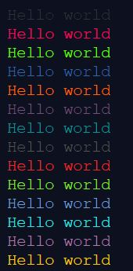

# Colors in python


#### A simple method to print text nicely or style text using python, without any plugin or package.


#### the ANSI codes are stored in variables, making them easier to use

```
black = "\033[0;30m"
red = "\033[0;31m"
green = "\033[0;32m"
yellow = "\033[0;33m"
blue = "\033[0;34m"
magenta = "\033[0;35m"
cyan = "\033[0;36m"
white = "\033[0;37m"
bright_black = "\033[0;90m"
bright_red = "\033[0;91m"
bright_green = "\033[0;92m"
bright_yellow = "\033[0;93m"
bright_blue = "\033[0;94m"
bright_magenta = "\033[0;95m"
bright_cyan = "\033[0;96m"
bright_white = "\033[0;97m"


print(black + "Hello world")
print(red + "Hello world")
print(green + "Hello world")
print(blue + "Hello world")
print(yellow + "Hello world")
print(magenta + "Hello world")
print(cyan + "Hello world")
print(bright_black + "Hello world")
print(bright_red + "Hello world")
print(bright_green + "Hello world")
print(bright_blue + "Hello world")
print(bright_cyan + "Hello world")
print(bright_magenta + "Hello world")
print(bright_yellow + "Hello world")
```

#### output:


